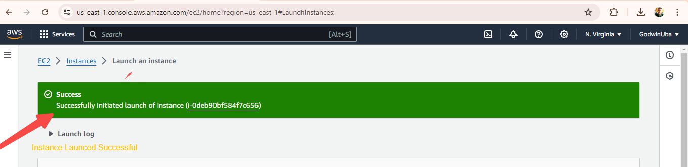
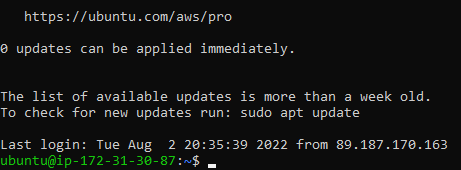
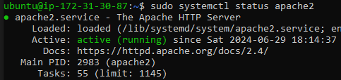
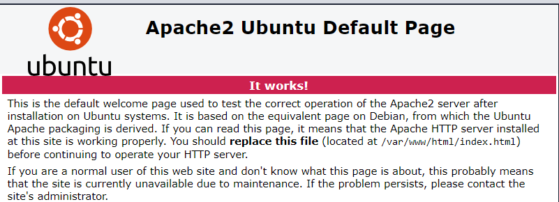

# LAMPSTACK
Lampstack project
# PROJECT 1
## WEB STACK IMPLEMENTATION (LAMP STACK) IN AWS
### Welcome to your very first PBL Project
You must be really excited to start getting your hands dirty. There is a lot of projects ahead, so without any delay, lest get started.

## Step 1
### Launch an Ec2 instance of t2.micro with ubuntu server 20.04 LTS (HVM)
1.	AWS account setup and Provisioning an Ubuntu Server
2.	Connecting to your EC2 Instance
Or follow the instructions below.
1.	Register a new AWS account following this instruction.
2.	Select your preferred region (the closest to you) and launch a new EC2 instance of t2.micro family with Ubuntu Server 20.04 LTS (HVM)

# SSH into the ubuntu instance
-  Both Putty and ssh use the SSH protocol to establish connectivity between computers. It is the most secure protocol because it uses crypto algorithms to encrypt the data that is transmitted – it uses TCP port 22 which is open for all newly created EC2 instances in AWS by default
-	Change directory into the location where your PEM file is. Most likely will be in the Downloads folder
- `cd Download`
- 	Change permissions for the private key file (.pem), otherwise you can get an error “Bad permission
- `sudo chmod 0400 <private-key-name>. pem`
connect instance by runnning:
`ssh -i <private-key-name>. pem ubuntu@<Public-IP-address>`

## Step 2: INSTALLING APACHE AND UPDATING THE FIREWALL
Apache is an open-source software available for free. It runs on 67% of all webservers in the world. It is fast, reliable, and secure. It can be highly customized to meet the needs of many different environments by using extensions and modules. Most WordPress hosting providers use Apache as their web server software.
- Install Apache using Ubuntu’s package manager ‘apt’
 1. #Update a list of packages in package manager
`sudo apt update`
2. #Run apache2 package installation
`sudo apt install apache2`
- To verify that apache2 is running as a Service in our OS, use following command
`sudo systemctl status apache2`
*If it is green and running, then you did everything correctly – you have just launched your first Web Server in the Clouds!*

Our server is running and we can access it locally and from the Internet (Source 0.0.0.0/0 means ‘from any IP address’).

First, let us try to check how we can access it locally in our Ubuntu shell, run:
``curl http://localhost:80``
or	
 ``curl http://127.0.0.1:80``

Open a web browser of your choice and try to access following url
``http://<Public-IP-Address>:80``

## STEP 3 — INSTALLING MYSQL
Now that you have a web server up and running, you need to install a Database Management System (DBMS) to be able to store and manage data for your site in a relational database

- Again, use ‘apt’ to acquire and install this software:
 `sudo apt install mysql-server -y`
 When the installation is finished, log in to the MySQL console by typing:
 `sudo mysql`
 This will connect to the MySQL server as the administrative database user root, which is inferred by the use of sudo when running this command You should see output like this:
 

 - It’s recommended that you run a security script that comes pre-installed with MySQL. This script will remove some insecure default settings and lock down access to your database system.
`ALTER USER 'root'@'localhost' IDENTIFIED WITH mysql_native_password BY 'PassWord.1';`
- exit the MYSQL shell with mysql> `exit` 
- start the interacting script by running:
`sudo mysql_secure_installation -y`

- When you’re finished, test if you’re able to log in to the MySQL console by typing:
 `sudo mysql -p`

 
